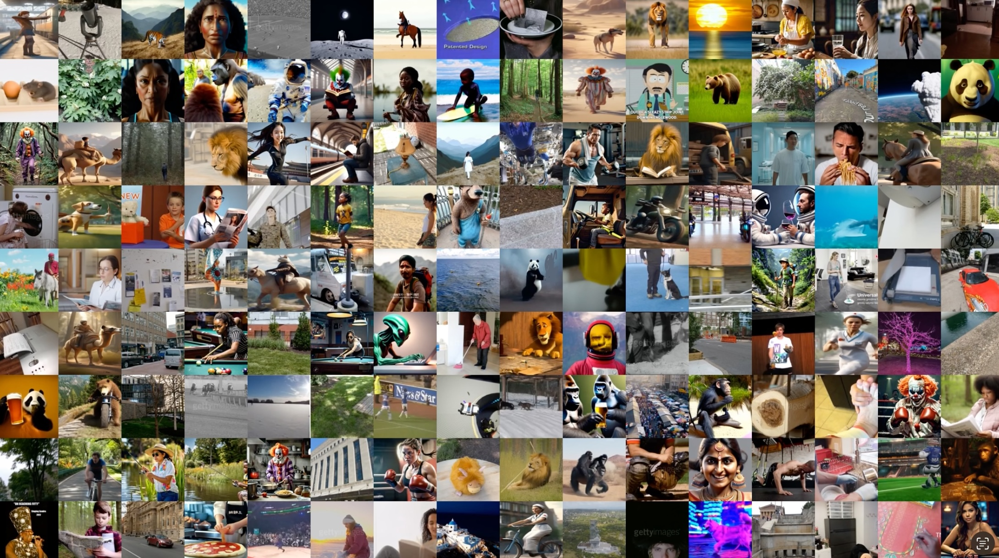

** UNDER CONSTRUCTION **

# SAFE: Video Challenge    <!-- omit from toc -->

 

**👉 All participants are required to register for the competition by filling out this [Google Form](https://forms.gle/46DZUGGzk2wdS64z7)**

[📊 Overview](#-overview) • [🥇 Detailed Leaderboard](#-detailed-leaderboard) • [🏆 Prize](#-prize) • [📢Results Sharing and Poster Session](#-results-sharing-and-poster-session) • [📝 Tasks](#-challenge-tasks) • [📈 Data](#-data) • [🤖 Model Submission](#-model-submission) • [📂 Create Model Repo](#-create-model-repo) • [🔘 Submit](#-submit) • [🆘 Helpful Stuff](#-helpful-stuff) • [🔍 Evaluation](#-evaluation) • [⚖️ Rules](#️-rules)

## 📣 Updates

## 📊 Overview

To advance the state of the art in video forensics, we are launching a funded evaluation challenge at the [Authenticity and Provenance in the Age of Generative AI (APAI) workshop](https://sites.google.com/berkeley.edu/apai-iccv2025) at ICCV 2025. This challenge will drive innovation in detecting and attributing fully synthetic and manipulated video content. It will focus on several critical dimensions, including generalizability across diverse visual domains, robustness against evolving generative video techniques, and scalability for real-world deployment. As generative video technologies rapidly advance—with increasing accessibility and sophistication of image-to-video, text-to-video, and adversarially optimized pipelines—the need for effective and reliable solutions to authenticate visual content has become urgent. Sponsored by the ULRI Digital Safety Research Institute, this initiative aims to mobilize the research community to confront these challenges and strengthen global efforts in media integrity and trust. 

Sign up here to participate and receive updates: [Google Form](https://forms.gle/46DZUGGzk2wdS64z7)

## 🥇 Detailed Leaderboard
coming soon ...
 <!-- 
 
[Public Leaderboard](https://safe-challenge-leaderboard-public.hf.space)
 
<iframe
	src="https://safe-challenge-leaderboard-public.hf.space"
	frameborder="0"
	width="850"
	height="450"
></iframe>

-->

## 🏆 Prize

The most promising solutions may be eligible for research grants to further advance their development. A travel stipend will be available to the highest-performing teams to support attendance at the APAI workshop at ICCV 2025, where teams can showcase their technical approach and results.

**All participants are required to register for the competition**

- Sign up here to participate and receive updates: [Google Form](https://docs.google.com/forms/d/1kiG8FF84-3e9dated4nHF0IeuCIbxNwAyxDRTTkljBU)
- For info please contact: SafeChallenge2025@gmail.com
- See instructions on how to submit and [🆘 Helpful Stuff](#-helpful-stuff), [debug example](debug_example.md), open issues for reference or join our [discord server](https://discord.gg/bxNsutKmTH)

## 📢 Results Sharing and Poster Session
In addition to leaderboard rankings and technical evaluations, participants will have the opportunity to share insights, methodologies, and lessons learned through an optional poster session at the APAI Workshop at ICCV 2025. Participants will be invited to present a poster at the workshop, showcasing their approach and findings to fellow researchers, practitioners, and attendees. To facilitate this engagement, we will collect 250-word abstracts in advance. These abstracts should briefly describe your method, key innovations, and any noteworthy performance observations. Submission details and deadlines will be announced on the challenge website. This is a valuable opportunity to contribute to community knowledge, exchange ideas, and build collaborations around advancing synthetic video detection.

## 🧠 Challenge Tasks
The SAFE: Synthetic Video Challenge at APAI @ ICCV 2025 will consist of several tasks. **This competition will be fully blind.** No data will be released. Only a small sample dataset will be released for debugging purposes. The competition is hosted [Huggingface Hub](https://huggingface.co/collections/safe-challenge/video-challenge-2025-685437e7a269a56e9d310ea8)

### 🚀 Pilot Task: Detection of Synthetic Video Content
-  The objective is to detect synthetically generated video clips.
-  The data will consists of real and synthetic videos generated by an older generative models. The videos will cover a wide range of content natural scenes, humans, animanls, etc.
-  This purpose of the pilot task is to allows participants to test initial submission logistics,to support early experimentation and understand task dynamics before later tasks open.
 [TBD](https://huggingface.co/spaces/safe-challenge/VideoChallengePilot)

### 🎯 Task 1: Detection of Synthetic Video Content
-  The objective is to detect synthetically generated video clips.
-  The data will consists of real and synthetic videos generated by a range of state-of-the-art techniques, including text-to-video, image-to-video, and other generative video models. The videos will cover a wide range of content natural scenes, humans, animanls, etc.
-  The focus will be on generalization to unseen generators, robustness to visual variability, and applicability to real-world forensics workflows.
 [TBD]()

🔮 Additional tasks will be announced leading up to ICCV 2025. These may explore areas such as manipulation detection, attribution of generative models, laundering detection, or characterization of generative content. Stay tuned for updates on new challenge tracks and associated datasets.

  
## 🤖 Model Submission

This is a script based competetion. No data will be released before the competition. A subset of the data may be released after the competition. Competition will be hosted on [Huggingface Hub](https://huggingface.co/collections/safe-challenge/video-challenge-2025-685437e7a269a56e9d310ea8). There will be a limit to number of submissions per day. 

### 📂 Create Model Repo  
Participants will be required to submit their model to be evaluated on the dataset by creating a [huggingface](https://huggingface.co/new) model repository. Please use [the example model repo](https://huggingface.co/safe-challenge/safe-video-example-submission) as a template.
- **The model that you submit will remain private**. No one inlcuding the challenge organizers will have access to the model repo unless you decide to make the repo public.
- The dataset will be automatically downloaded to `/tmp/data` inside the container during the evaluation run. See example model on how to load it.
- The model will be expected to read in the dataset and output file containing a **id, binary decision, detection score,** for every input example.
- The only requirement is to have a `script.py` in the top level of the repo that saves a `submission.csv` file with the following columns. See [sample practice submission file](sample_practice_submission.csv).
  - `id` : id of the example, strig
  - `pred` : binary decision, string, "generated" or "real"
  - `score`: decision score such as log likelihood score. Postive scores correspond to generated and negative to real. (This is optional and not used in evaluation but will help with analysis later)  
- All submissions will be evaluated using the same resources: NVIDIA `L4` GPU instance. It has 8vCPUs, 30GB RAM, 24GB VRAM.
- All submissions will be evaluated using the same container based [nvidia/cuda:12.6.2-cudnn-runtime-ubuntu24.04](https://hub.docker.com/layers/nvidia/cuda/12.6.2-cudnn-runtime-ubuntu24.04/images/sha256-3e6da5b4b9fb377bde3427725c31bf2e926a975a783a9131f7ec6da7705fff85) image
  - Default [`requirments.txt`](requirements.txt) file will be installed in the eval environment
  - You can optionally provide a custom `requirements.txt` just include it in the top level of your submission repo (see [the example model repo](https://huggingface.co/safe-challenge/safe-video-example-submission)). Make sure to include `datasets` to read the dataset file.
  - **During evalation, container will not have access to the internet**. Participants should include all other required dependencies in the model repo.
  - **💡 Remember: you can add anything to your model repo** like models, python packages, etc.
- We encourage everyone to test your models locally using a debug dataset. See [debug example](debug_example.md)

### 🔘 Submit  
Once your model is ready, it's time to submit:   
  - Go the task submision space (there is a seperate space for every task)
  - Login with your Huggingface Credentials
  - Teams consisting of multiple individuals should plan to submit under one Huggingface account to facilitate review and analysis results and use the same team name
  - Enter the the repo of your model e.g. `safe-challenge/safe-example-submission` and click submit! 🎉
  - You can check the status of your submission under `My Submissions` page. 
  - If the status is failed, you can debug locally or reach out to us via [email](SafeChallenge2025@gmail.com) or on our [discord server](https://discord.gg/bxNsutKmTH). Just include the task and submission id. We are happy to debug.

### 🆘 How to get help
We provide an example model submission repo and a local debug example:
- Take a look at an example model repo: [https://huggingface.co/safe-challenge/safe-video-example-submission](https://huggingface.co/safe-challenge/safe-video-example-submission)
- To reproduce all the steps in the submission locally, take a look at the debugging example: [debug example](debug_example.md)
<!-- - We encourage you to submit to a practice competition: [https://huggingface.co/spaces/safe-challenge/SAFEChallengePractice](https://huggingface.co/spaces/safe-challenge/SAFEChallengePractice) -->
<!-- - It's using this practice dataset: [https://huggingface.co/datasets/safe-challenge/safe-challenge-practice-dataset](https://huggingface.co/datasets/safe-challenge/safe-challenge-practice-dataset) -->
- You won't be able to see any detailed error if your submission fails since it's run in a private space. *Just reach out to us via [email](SafeChallenge2025@gmail.com) or on our [discord server](https://discord.gg/bxNsutKmTH) and we can look up the logs.* The easiest way is to trouble shoot locally using the above example.
<!-- - *🔥New* [Example on including a custom environment in your model repo](https://huggingface.co/safe-challenge/safe-example-submission-custom-env) -->

## 🔍 Evaluation

All submissions will be evalulated using balanced accuracy. Balanced accuracy is defined as an average of true positive rate and true negative rate. 

The competition page will maintain a public leaderboard and a private leaderboard. The data will be devided along the sources such that public leaderboard will be a subset of the private leaderboard. A detailed public leaderboard will also show error rates for every source, However, the specific source name will be anonymized.

<!--   -->

To enable these deeper analyses and fairness evaluations, all participants are required to submit both:
A hard binary prediction (synthetic vs. real)
A continuous confidence score for each input sample
This design enables richer insight into system calibration, decision boundaries, and detection confidenc

## ⚖️ Rules

To ensure a fair and rigorous evaluation process for the Synthetic and AI Forensic Evaluations (SAFE) - Synthetic Video Challenge Registration, the following rules must be adhered to by all participants:

1. **Leaderboard**:
   - The competition will maintain both a public and a private leaderboard.
   - The public leaderboard will show error rates for each anonymized source.
   - The private leaderboard will be used for the final evaluation and will include non-overlapping data from the public leaderboard.

2. **Submission Limits**:
   - Participants will be limited in submissions per day.

3. **Confidentiality**:
   - Participants agree not to publicly compare their results with those of other participants until the other participant’s results are published outside of the conference venue.
   - Participants are free to use and publish their own results independently.

4. **Compliance**:
   - Participants must comply with all rules and guidelines provided by the organizers.
   - Failure to comply with the rules may result in disqualification from the competition and exclusion from future evaluations.

By participating in the SAFE challenge, you agree to adhere to these evaluation rules and contribute to the collaborative effort to advance the field of video forensics.
